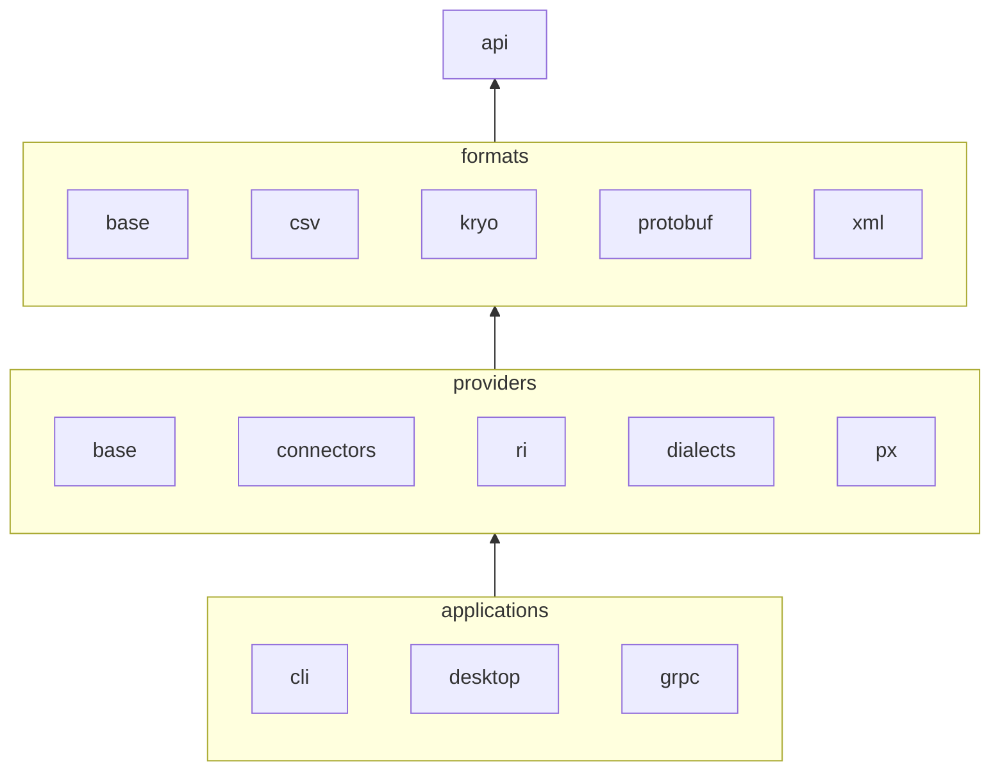

**sdmx-dl API** is a library designed as a facade for the SDMX model and APIs.

Web example:
```java
SdmxWebManager
    .ofServiceLoader()
    .usingName("ECB")
    .getData(KeyRequest
        .builder()
        .flowOf("EXR")
        .keyOf("M.CHF+USD.EUR.SP00.A")
        .build())
    .forEach(series -> System.out.printf(Locale.ROOT, "%s: %d obs%n", series.getKey(), series.getObs().size()));
```

File example:
```java
SdmxFileManager
    .ofServiceLoader()
    .usingFile(dataFile())
    .getData(KeyRequest
        .builder()
        .flowOf("data")
        .keyOf("A.DEU.1.0.319.0.UBLGE")
        .build())
    .forEach(series -> System.out.printf(Locale.ROOT, "%s: %d obs%n", series.getKey(), series.getObs().size()));
```

## Structure overview



## Dependencies setup

sdmx-dl is **distributed in two different ways**: a **standard JAR hierarchy**, and a **standalone uber JAR** containing all the implementations and their dependencies.
Most of the standalone JAR’s dependencies are shaded i.e. they are hidden in alternative packages.
This allows sdmx-dl to be used as a zero-dependency library in projects without conflicting with other dependencies.

Standalone uber JAR (zero-dependency):

```xml
<dependencies>
  <dependency>
    <groupId>com.github.nbbrd.sdmx-dl</groupId>
    <artifactId>sdmx-dl-standalone</artifactId>
  </dependency>
</dependencies>
```

Standard JAR hierarchy:

```xml
<dependencies>
  <dependency>
    <groupId>com.github.nbbrd.sdmx-dl</groupId>
    <artifactId>sdmx-dl-api</artifactId>
  </dependency>
  <dependency>
    <groupId>com.github.nbbrd.sdmx-dl</groupId>
    <artifactId>sdmx-dl-ri</artifactId>
    <scope>runtime</scope>
  </dependency>
  <dependency>
    <groupId>com.github.nbbrd.sdmx-dl</groupId>
    <artifactId>sdmx-dl-dialects</artifactId>
    <scope>runtime</scope>
  </dependency>
</dependencies>
```
