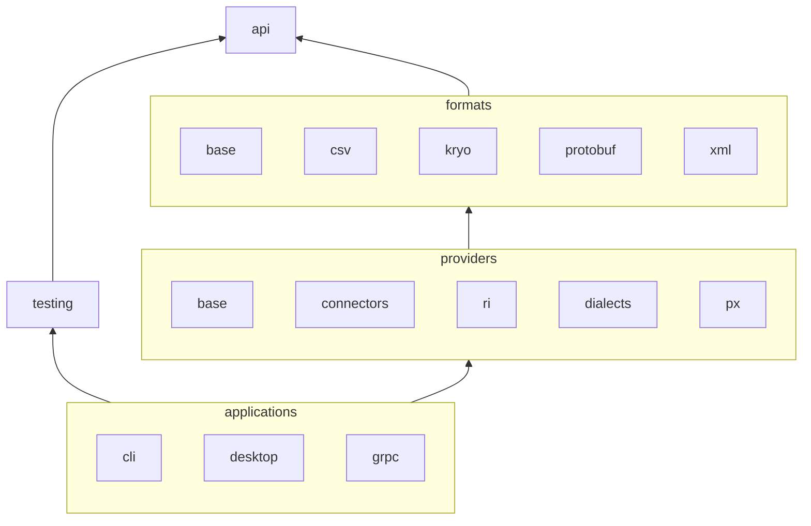

**sdmx-dl API** is a library designed as a facade for the SDMX model and APIs.

## Structure overview



## Dependencies setup

sdmx-dl is **distributed in two flavours**: a **standard JAR hierarchy**, and a **standalone uber JAR** containing all the implementations and their dependencies.
Most of the standalone JAR’s dependencies are shaded i.e. they are hidden in alternative packages.
This allows sdmx-dl to be used in projects with conflicting versions of its dependencies.

Standard JAR hierarchy:

```xml
<dependencies>
  <dependency>
    <groupId>com.github.nbbrd.sdmx-dl</groupId>
    <artifactId>sdmx-dl-api</artifactId>
  </dependency>
  <dependency>
    <groupId>com.github.nbbrd.sdmx-dl</groupId>
    <artifactId>sdmx-dl-ri</artifactId>
    <scope>runtime</scope>
  </dependency>
  <dependency>
    <groupId>com.github.nbbrd.sdmx-dl</groupId>
    <artifactId>sdmx-dl-dialects</artifactId>
    <scope>runtime</scope>
  </dependency>
</dependencies>
```

Standalone uber JAR:

```xml
<dependencies>
  <dependency>
    <groupId>com.github.nbbrd.sdmx-dl</groupId>
    <artifactId>sdmx-dl-api</artifactId>
  <dependency>
    <groupId>com.github.nbbrd.sdmx-dl</groupId>
    <artifactId>sdmx-dl-standalone</artifactId>
    <scope>runtime</scope>
  </dependency>
</dependencies>
```
