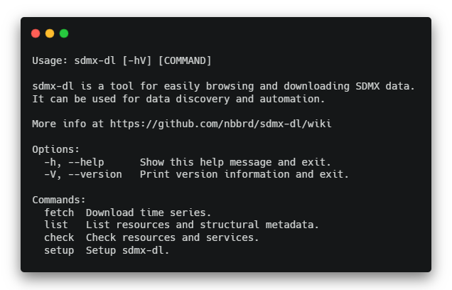

**sdmx-dl CLI** is a tool for easily browsing and downloading SDMX data.  
It can be used for **data discovery** and **automation**.

This tool follows the Unix philosophy of [_"Do one thing and do it well"_](https://en.wikipedia.org/wiki/Unix_philosophy#Do_One_Thing_and_Do_It_Well) by performing a single function and beeing composable.


