By default, all commands print the result on the [standard output](https://en.wikipedia.org/wiki/Standard_streams#Standard_output_(stdout)).  
Most commands produce [RFC4180](https://tools.ietf.org/html/rfc4180) compliant [CSV](https://en.wikipedia.org/wiki/Comma-separated_values) content.

Command arguments are composed of options and positional parameters. Options have a name, positional parameters are usually the values that follow the options, but they may be mixed. The general pattern is:
<pre>
sdmx-dl <u>fetch data</u> <u>ECB EXR M.CHF.EUR.SP00.A</u> <u>-o chf.csv</u>
         <i>command</i>         <i>parameters</i>          <i>options</i>
</pre>

All commands share the following options:
- [`-h, --help`](../options#help) - Show an help message and exit.
- [`-v, --verbose`](../options#verbose) -  Enable verbose mode.

## Commands summary

The commands follow a **verb+noun hierarchy**.

```mermaid
%%{init:{'themeVariables': {'textColor': '#fdf6e3', 'fontSize': '12px'},'flowchart':{'nodeSpacing': 5, 'rankSpacing': 30}}}%%
flowchart TB
    r{{sdmx-dl}}
    r --- f([fetch]) --- data & meta & keys
    r --- l([list]) --- sources & flows & dimensions & attributes & codes & availability & features & drivers
    r --- c([check]) --- status & access & config
    r --- s([setup]) --- completion & launcher

    classDef default fill:#93a1a1,stroke-width:0px 
    linkStyle default stroke:#93a1a1
 
    classDef fx fill:#dc322f
    class f,data,meta,keys fx;
    click f "#fetch" "fetch command"
    click data "#fetch-data" "fetch data command"
    click meta "#fetch-meta" "fetch meta command"
    click keys "#fetch-keys" "fetch keys command"
   
    classDef lx fill:#859900
    class l,sources,flows,dimensions,attributes,codes,availability,features,drivers lx;
    click l "#list" "list command"
    click sources "#list-sources" "list sources command"
    click flows "#list-flows" "list flows command"
    click dimensions "#list-dimensions" "list dimensions command"
    click attributes "#list-attributes" "list attributes command"
    click codes "#list-codes" "list codes command"
    click availability "#list-availability" "list availability command"
    click features "#list-features" "list features command"
    click drivers "#list-drivers" "list drivers command"
   
    classDef cx fill:#268bd2
    class c,status,access,config cx;
    click c "#check" "check command"
    click status "#check-status" "check status command"
    click access "#check-access" "check access command"
    click config "#check-config" "check config command"
    
    classDef sx fill:#b58900
    class s,completion,launcher sx;
    click s "#setup" "setup command"
    click completion "#setup-completion" "setup completion command"
    click launcher "#setup-launcher" "setup launcher command"
```



Download time series.

Subcommands:
[data](#fetch-data),
[meta](#fetch-meta),
[keys](#fetch-keys)

[Examples]()



List resources and structural metadata.

Subcommands:
[sources](#list-sources),
[flows](#list-flows),
[dimensions](#list-dimensions),
[attributes](#list-attributes),
[codes](#list-codes),
[availability](#list-availability),
[features](#list-features),
[drivers](#list-drivers)

[Examples]()



Check resources and services.

Subcommands:
[status](#check-status),
[access](#check-access),
[config](#check-config)



Setup sdmx-dl.

Subcommands:
[completion](#setup-completion),
[launcher](#setup-launcher)

## Commands details



Download time series observations.

Example: <code>sdmx-dl fetch data <abbr title="source">ECB</abbr> <abbr title="flow">EXR</abbr> <abbr title="key">M.USD+CHF.EUR.SP00.A</abbr></code>  

Parameters:
- [`source`](../datatypes#source) - Data source name.
- [`flow`](../datatypes#flow) - Data flow reference.
- [`key`](../datatypes#key) - Data key.

Main options:  
- [`-s, --sources<file>`](../options#sources) - File that provides data source definitions.
- [`-l, --languages<langs>`](../options#languages) - Language priority list.

Other options: 
[`CSV`](../options#csv),
[`Network`](../options#network)

Output format:
[
    [`Series:key`](../datatypes#key),
    [`ObsAttributes:map`](../datatypes#map),
    [`ObsPeriod:datetime`](../datatypes#datetime),
    [`ObsValue:number`](../datatypes#number)
]



| Series           | ObsAttributes | ObsPeriod           | ObsValue          |
|------------------|---------------|---------------------|-------------------|
| M.CHF.EUR.SP00.A | OBS_STATUS=A  | 1999-01-01T00:00:00 | 1.605495          |
| M.CHF.EUR.SP00.A | OBS_STATUS=A  | 1999-02-01T00:00:00 | 1.59785           |
| M.CHF.EUR.SP00.A | OBS_STATUS=A  | 1999-03-01T00:00:00 | 1.595430434782609 |
| M.CHF.EUR.SP00.A | OBS_STATUS=A  | 1999-04-01T00:00:00 | 1.601531818181818 |





Download time series metadata.  

Example: <code>sdmx-dl fetch meta <abbr title="source">ECB</abbr> <abbr title="flow">EXR</abbr> <abbr title="key">M.USD+CHF.EUR.SP00.A</abbr></code>  

Parameters:
- [`source`](../datatypes#source) - Data source name.
- [`flow`](../datatypes#flow) - Data flow reference.
- [`key`](../datatypes#key) - Data key.

Main options:  
- [`-s, --sources<file>`](../options#sources) - File that provides data source definitions.
- [`-l, --languages<langs>`](../options#languages) - Language priority list.
- [`--sort`](../options#sort) - Sort output.

Other options: 
[`CSV`](../options#csv),
[`Network`](../options#network)

Output format: 
[
    [`Series:key`](../datatypes#key),
    [`Concept:string`](../datatypes#string),
    [`Value:string`](../datatypes#string)
]



| Series           | Concept       | Value            |
|------------------|---------------|------------------|
| M.CHF.EUR.SP00.A | COLLECTION    | A                |
| M.CHF.EUR.SP00.A | UNIT          | CHF              |
| M.CHF.EUR.SP00.A | DECIMALS      | 4                |
| M.CHF.EUR.SP00.A | SOURCE_AGENCY | 4F0              |
| M.CHF.EUR.SP00.A | UNIT_MULT     | 0                |
| M.CHF.EUR.SP00.A | TITLE         | Swiss franc/Euro |





Download time series keys.  

Example: <code>sdmx-dl fetch keys <abbr title="source">ECB</abbr> <abbr title="flow">EXR</abbr> <abbr title="key">M.USD+CHF.EUR.SP00.A</abbr></code>

Parameters:
- [`source`](../datatypes#source) - Data source name.
- [`flow`](../datatypes#flow) - Data flow reference.
- [`key`](../datatypes#key) - Data key.

Main options:  
- [`-s, --sources<file>`](../options#sources) - File that provides data source definitions.
- [`-l, --languages<langs>`](../options#languages) - Language priority list.
- [`--sort`](../options#sort) - Sort output.

Other options: 
[`CSV`](../options#csv),
[`Network`](../options#network)

Output format: 
[
    [`Series:key`](../datatypes#key)
]



| Series           |
|------------------|
| A.CHF.EUR.SP00.A |
| D.CHF.EUR.SP00.A |
| H.CHF.EUR.SP00.A |
| M.CHF.EUR.SP00.A |





List data source names and properties.  

Example: <code>sdmx-dl list sources</code>  

Main options:  
- [`-s, --sources<file>`](../options#sources) - File that provides data source definitions.

Other options: 
[`CSV`](../options#csv)

Output format: 
[
    [`Name:source`](../datatypes#source),
    [`Description:string`](../datatypes#string),
    [`Aliases:list`](../datatypes#list),
    [`Driver:string`](../datatypes#string),
    [`Endpoint:uri`](../datatypes#uri),
    [`Properties:map`](../datatypes#list),
    [`Website:url`](../datatypes#url),
    [`Monitor:uri`](../datatypes#uri),
    [`MonitorWebsite:url`](../datatypes#url),
    [`Languages:list`](../datatypes#list)
]



| Name  | Description                     | Aliases  | Driver              | Endpoint                                         | Properties           | Website                                     | Monitor                           | MonitorWebsite                                     | Languages |
|-------|---------------------------------|----------|---------------------|--------------------------------------------------|----------------------|---------------------------------------------|-----------------------------------|----------------------------------------------------|-----------|
| ABS   | Australian Bureau of Statistics |          | ri:abs              | https://stat.data.abs.gov.au/restsdmx/sdmx.ashx  |                      | https://stat.data.abs.gov.au                | upptime:/nbbrd/sdmx-upptime/ABS   | https://nbbrd.github.io/sdmx-upptime/history/abs   | en        |
| ECB   | European Central Bank           |          | ri:sdmx21           | https://sdw-wsrest.ecb.europa.eu/service         | detailSupported=true | https://sdw.ecb.europa.eu                   | upptime:/nbbrd/sdmx-upptime/ECB   | https://nbbrd.github.io/sdmx-upptime/history/ecb   | en        |
| ESTAT | Eurostat                        | EUROSTAT | connectors:eurostat | https://ec.europa.eu/eurostat/SDMX/diss-web/rest |                      | https://ec.europa.eu/eurostat/data/database | upptime:/nbbrd/sdmx-upptime/ESTAT | https://nbbrd.github.io/sdmx-upptime/history/estat | en,de,fr  |





List data flows.  

Example: <code>sdmx-dl list flows <abbr title="source">ECB</abbr></code>  

Parameters:
- [`source`](../datatypes#source) - Data source name.

Main options:  
- [`-s, --sources<file>`](../options#sources) - File that provides data source definitions.
- [`-l, --languages<langs>`](../options#languages) - Language priority list.
- [`--sort`](../options#sort) - Sort output.

Other options: 
[`CSV`](../options#csv),
[`Network`](../options#network)

Output format: 
[
    [`Ref:flow`](../datatypes#flow),
    [`Name:string`](../datatypes#string),
    [`Description:string`](../datatypes#string)
]



| Ref          | Name                           | Description |
|--------------|--------------------------------|-------------|
| ECB:AME(1.0) | AMECO                          |             |
| ECB:BKN(1.0) | Banknotes statistics           |             |
| ECB:BLS(1.0) | Bank Lending Survey Statistics |             |





List data flow dimensions.  

Example: <code>sdmx-dl list dimensions <abbr title="source">ECB</abbr> <abbr title="flow">EXR</abbr></code>  

Parameters:
- [`source`](../datatypes#source) - Data source name.
- [`flow`](../datatypes#flow) - Data flow reference.

Main options:  
- [`-s, --sources<file>`](../options#sources) - File that provides data source definitions.
- [`-l, --languages<langs>`](../options#languages) - Language priority list.
- [`--sort`](../options#sort) - Sort output.

Other options: 
[`CSV`](../options#csv),
[`Network`](../options#network)

Output format: 
[
    [`Name:string`](../datatypes#string),
    [`Label:string`](../datatypes#string),
    [`Coded:bool`](../datatypes#bool),
    [`Index:int`](../datatypes#int)
]



| Name           | Label                          | Coded | Index |
|----------------|--------------------------------|-------|-------|
| FREQ           | Frequency                      | true  | 0     |
| CURRENCY       | Currency                       | true  | 1     |
| CURRENCY_DENOM | Currency denominator           | true  | 2     |
| EXR_TYPE       | Exchange rate type             | true  | 3     |
| EXR_SUFFIX     | Series variation - EXR context | true  | 4     |





List data flow attributes.

Example: <code>sdmx-dl list attributes <abbr title="source">ECB</abbr> <abbr title="flow">EXR</abbr></code>

Parameters:
- [`source`](../datatypes#source) - Data source name.
- [`flow`](../datatypes#flow) - Data flow reference.

Main options:
- [`-s, --sources<file>`](../options#sources) - File that provides data source definitions.
- [`-l, --languages<langs>`](../options#languages) - Language priority list.
- [`--sort`](../options#sort) - Sort output.

Other options:
[`CSV`](../options#csv),
[`Network`](../options#network)

Output format:
[
[`Name:string`](../datatypes#string),
[`Label:string`](../datatypes#string),
[`Coded:bool`](../datatypes#bool),
[`Relationship:enum`](../datatypes#enum)
]



| Concept     | Label              | Coded | Relationship |
|-------------|--------------------|-------|--------------|
| TIME_FORMAT | Time format code   | false | SERIES       |
| OBS_STATUS  | Observation status | true  | OBSERVATION  |
| DECIMALS    | Decimals           | true  | GROUP        |





List codes from data flow concept.  

Example: <code>sdmx-dl list codes <abbr title="source">ECB</abbr> <abbr title="flow">EXR</abbr> <abbr title="concept">FREQ</abbr></code>  

Parameters:
- [`source`](../datatypes#source) - Data source name.
- [`flow`](../datatypes#flow) - Data flow reference.
- [`concept`](../datatypes#string) - Concept name.

Main options:  
- [`-s, --sources<file>`](../options#sources) - File that provides data source definitions.
- [`-l, --languages<langs>`](../options#languages) - Language priority list.
- [`--sort`](../options#sort) - Sort output.

Other options: 
[`CSV`](../options#csv),
[`Network`](../options#network)

Output format: 
[
    [`Code:string`](../datatypes#string),
    [`Label:string`](../datatypes#string)
]



| Code | Label                |
|------|----------------------|
| A    | Annual               |
| Q    | Quarterly            |
| B    | Daily - businessweek |





List available dimension codes.

Example: <code>sdmx-dl list availability <abbr title="source">ECB</abbr> <abbr title="flow">EXR</abbr> <abbr title="key">M.CHF...</abbr> <abbr title="index">4</abbr></code>

Parameters:
- [`source`](../datatypes#source) - Data source name.
- [`flow`](../datatypes#flow) - Data flow reference.
- [`key`](../datatypes#key) - Data key.
- [`index`](../datatypes#int) - Zero-based index of key dimension.

Main options:
- [`-s, --sources<file>`](../options#sources) - File that provides data source definitions.
- [`-l, --languages<langs>`](../options#languages) - Language priority list.
- [`--sort`](../options#sort) - Sort output.

Other options:
[`CSV`](../options#csv),
[`Network`](../options#network)

Output format:
[
[`Code:string`](../datatypes#string)
]



| Code |
|------|
| A    |
| E    |





List supported features of a data source.  

Example: <code>sdmx-dl list features <abbr title="source">ECB</abbr></code>  

Parameters:
- [`source`](../datatypes#source) - Data source name.

Main options:  
- [`-s, --sources<file>`](../options#sources) - File that provides data source definitions.
- [`-l, --languages<langs>`](../options#languages) - Language priority list.
- [`--sort`](../options#sort) - Sort output.

Other options: 
[`CSV`](../options#csv),
[`Network`](../options#network)

Output format: 
[
    [`SupportedFeature:enum`](../datatypes#enum)
]



| SupportedFeature |
|------------------|
| SERIES_KEYS_ONLY |





List driver names and properties.  

Example: <code>sdmx-dl list drivers</code>  

Main options:  
- [`-s, --sources<file>`](../options#sources) - File that provides data source definitions.

Other options: 
[`CSV`](../options#csv)

Output format: 
[
    [`SupportedFeature:enum`](../datatypes#enum)
]



| Name       | SupportedProperties                                                                                    |
|------------|--------------------------------------------------------------------------------------------------------|
| ri:dotstat | connectTimeout,readTimeout,maxRedirects,preemptiveAuthentication                                       |
| ri:nbb     | connectTimeout,readTimeout,maxRedirects,preemptiveAuthentication                                       |
| ri:sdmx21  | connectTimeout,readTimeout,maxRedirects,preemptiveAuthentication,detailSupported,trailingSlashRequired |





Check service availability.  

Example: <code>sdmx-dl check status <abbr title="source">ECB</abbr></code>  

Parameters:
- [`sources`](../datatypes#list) - Data source names.

Main options:  
- [`-s, --sources<file>`](../options#sources) - File that provides data source definitions.
- [`-l, --languages<langs>`](../options#languages) - Language priority list.
- [`--no-parallel`](../options#no-parallel) - Disable parallel queries.
- [`--sort`](../options#sort) - Sort output.

Other options: 
[`CSV`](../options#csv),
[`Network`](../options#network)

Output format: 
[
    [`Source:source`](../datatypes#source),
    [`Status:enum`](../datatypes#enum),
    [`UptimeRatio:double`](../datatypes#double),
    [`AverageResponseTime:double`](../datatypes#double),
    [`ErrorMessage:string`](../datatypes#string)
]



| Source | Status | UptimeRatio | AverageResponseTime | ErrorMessage |
|--------|--------|-------------|---------------------|--------------|
| ECB    | UP     | 99.691      |                     |              |





Check service accessibility.  

Example: <code>sdmx-dl check access <abbr title="source">ECB</abbr></code>  

Parameters:
- [`sources`](../datatypes#list) - Data source names.

Main options:  
- [`-s, --sources<file>`](../options#sources) - File that provides data source definitions.
- [`-l, --languages<langs>`](../options#languages) - Language priority list.
- [`--no-parallel`](../options#no-parallel) - Disable parallel queries.
- [`--sort`](../options#sort) - Sort output.

Other options: 
[`CSV`](../options#csv),
[`Network`](../options#network)

Output format: 
[
    [`Source:source`](../datatypes#source),
    [`Accessible:enum`](../datatypes#enum),
    [`DurationInMillis:int`](../datatypes#int),
    [`ErrorMessage:string`](../datatypes#string)
]



| Source | Accessible | DurationInMillis | ErrorMessage |
|--------|------------|------------------|--------------|
| ECB    | YES        | 726              |              |





Check sdmx-dl configuration.

Example: <code>sdmx-dl check config</code>  

Other options: 
[`CSV`](../options#csv)

Output format: 
[
    [`Scope:enum`](../datatypes#enum),
    [`PropertyKey:string`](../datatypes#string),
    [`PropertyValue:string`](../datatypes#string),
    [`Category:enum`](../datatypes#enum)
]



| Scope  | PropertyKey                       | PropertyValue                  | Category      |
|--------|-----------------------------------|--------------------------------|---------------|
| SYSTEM | sources                           | C:\temp\some-sources.xml       | WIDE_OPTION   | 
| SYSTEM | org.fusesource.jansi.Ansi.disable | true                           | OTHER         |
| GLOBAL | sources                           | C:\Users\ABC\other-sources.xml | WIDE_OPTION   |
| LOCAL  | sdmx-dl.check.status.verbose      | true                           | NARROW_OPTION |



 

 
