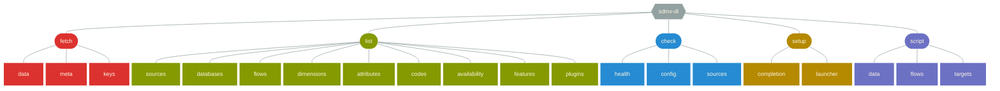

By default, all commands print the result on the [standard output](https://en.wikipedia.org/wiki/Standard_streams#Standard_output_(stdout)).  
Most commands produce [RFC4180](https://tools.ietf.org/html/rfc4180) compliant [CSV](https://en.wikipedia.org/wiki/Comma-separated_values) content.

Command arguments are composed of options and positional parameters. Options have a name, positional parameters are usually the values that follow the options, but they may be mixed. The general pattern is:
<pre>
sdmx-dl <u>fetch data</u> <u>ECB EXR M.CHF.EUR.SP00.A</u> <u>-o chf.csv</u>
         <i>command</i>         <i>parameters</i>          <i>options</i>
</pre>

All commands share the following options:
- [`-h, --help`](../options#help) - Show an help message and exit.
- [`-v, --verbose`](../options#verbose) -  Enable verbose mode.

## Commands summary

The commands follow a **verb+noun hierarchy**.

```mermaid
%%{init:{'themeVariables': {'textColor': '#fdf6e3', 'fontSize': '12px'},'flowchart':{'nodeSpacing': 5, 'rankSpacing': 30}}}%%
flowchart TB
    r{{sdmx-dl}}
    r --- f([fetch]) --- data & meta & keys
    r --- l([list]) --- sources & databases & flows & dimensions & attributes & codes & availability & features & plugins
    r --- c([check]) --- health & config & xsources[sources]
    r --- s([setup]) --- completion & launcher
    r --- x([script]) --- xdata[data] & xflows[flows] & targets

    classDef default fill:#93a1a1,stroke-width:0px 
    linkStyle default stroke:#93a1a1
 
    classDef fx fill:#dc322f
    class f,data,meta,keys fx;
    click f "#fetch" "fetch command"
    click data "#fetch-data" "fetch data command"
    click meta "#fetch-meta" "fetch meta command"
    click keys "#fetch-keys" "fetch keys command"
   
    classDef lx fill:#859900
    class l,sources,databases,flows,dimensions,attributes,codes,availability,features,plugins lx;
    click l "#list" "list command"
    click sources "#list-sources" "list sources command"
    click databases "#list-databases" "list databases command"
    click flows "#list-flows" "list flows command"
    click dimensions "#list-dimensions" "list dimensions command"
    click attributes "#list-attributes" "list attributes command"
    click codes "#list-codes" "list codes command"
    click availability "#list-availability" "list availability command"
    click features "#list-features" "list features command"
    click plugins "#list-plugins" "list plugins command"

    classDef cx fill:#268bd2
    class c,health,config,xsources cx;
    click c "#check" "check command"
    click health "#check-health" "check health command"
    click config "#check-config" "check config command"
    click xsources "#check-sources" "check sources command"
    
    classDef sx fill:#b58900
    class s,completion,launcher sx;
    click s "#setup" "setup command"
    click completion "#setup-completion" "setup completion command"
    click launcher "#setup-launcher" "setup launcher command"

    classDef xx fill:#6c71c4
    class x,xdata,xflows,targets xx;
    click x "#script" "script command"
    click xdata "#script-data" "script data command"
    click xflows "#script-flows" "script flows command"
    click targets "#script-targets" "script targets command"
```



Download time series.

Subcommands:
[data](#fetch-data),
[meta](#fetch-meta),
[keys](#fetch-keys)

[Examples]()



List resources and structural metadata. Every subcommand also accepts an optional free-text
[`-q, --query`](../options#query) to search/rank results by relevance (typo-tolerant), combined with
[`-m, --max-results`](../options#max-results) to limit how many are returned.

Subcommands:
[sources](#list-sources),
[databases](#list-databases),
[flows](#list-flows),
[dimensions](#list-dimensions),
[attributes](#list-attributes),
[codes](#list-codes),
[availability](#list-availability),
[features](#list-features),
[plugins](#list-plugins)

[Examples]()



Check resources and services.

Subcommands:
[health](#check-health),
[config](#check-config),
[sources](#check-sources)



Setup sdmx-dl.

Subcommands:
[completion](#setup-completion),
[launcher](#setup-launcher)



Generate ready-to-run scripts that perform a request in another language (see [Generate scripts]()).

Subcommands:
[data](#script-data),
[flows](#script-flows),
[targets](#script-targets)

## Commands details



Download time series observations.

Example: <code>sdmx-dl fetch data <abbr title="source">ECB</abbr> <abbr title="flow">EXR</abbr> <abbr title="key">M.USD+CHF.EUR.SP00.A</abbr></code>  




1. [`source`](../datatypes#source) - Data source name.
2. [`flow`](../datatypes#flow) - Data flow reference.
3. [`key`](../datatypes#key) - Data key.




Main options:
- [`-s, --sources<file>`](../options#sources) - File that provides data source definitions.
- [`-d, --database<database>`](../options#database) - Database reference.
- [`-l, --languages<langs>`](../options#languages) - Language priority list.

Other options:
[`CSV`](../options#csv),
[`Network`](../options#network)




CSV columns:
1. [`Series:key`](../datatypes#key)
2. [`ObsAttributes:map`](../datatypes#map)
3. [`ObsPeriod:datetime`](../datatypes#datetime)
4. [`ObsValue:number`](../datatypes#number)





<small></small>




Download time series metadata.  

Example: <code>sdmx-dl fetch meta <abbr title="source">ECB</abbr> <abbr title="flow">EXR</abbr> <abbr title="key">M.USD+CHF.EUR.SP00.A</abbr></code>  




1. [`source`](../datatypes#source) - Data source name.
2. [`flow`](../datatypes#flow) - Data flow reference.
3. [`key`](../datatypes#key) - Data key.




Main options:
- [`-s, --sources<file>`](../options#sources) - File that provides data source definitions.
- [`-d, --database<database>`](../options#database) - Database reference.
- [`-l, --languages<langs>`](../options#languages) - Language priority list.
- [`--sort`](../options#sort) - Sort output.

Other options: 
[`CSV`](../options#csv),
[`Network`](../options#network)




CSV columns:
1. [`Series:key`](../datatypes#key)
2. [`Concept:string`](../datatypes#string)
3. [`Value:string`](../datatypes#string)





<small></small>




Download time series keys.  

Example: <code>sdmx-dl fetch keys <abbr title="source">ECB</abbr> <abbr title="flow">EXR</abbr> <abbr title="key">M.USD+CHF.EUR.SP00.A</abbr></code>




1. [`source`](../datatypes#source) - Data source name.
2. [`flow`](../datatypes#flow) - Data flow reference.
3. [`key`](../datatypes#key) - Data key.




Main options:
- [`-s, --sources<file>`](../options#sources) - File that provides data source definitions.
- [`-d, --database<database>`](../options#database) - Database reference.
- [`-l, --languages<langs>`](../options#languages) - Language priority list.
- [`--sort`](../options#sort) - Sort output.

Other options: 
[`CSV`](../options#csv),
[`Network`](../options#network)




CSV columns:
1. [`Series:key`](../datatypes#key)





<small></small>




List or search data source names and properties. Sorted by id when [`-q, --query`](../options#query) is
empty; ranked by relevance (typo-tolerant) otherwise.

Example: <code>sdmx-dl list sources</code>  
Example: <code>sdmx-dl list sources <abbr title="query">-q "european central"</abbr></code>  




- _no parameters_




Main options:
- [`-s, --sources<file>`](../options#sources) - File that provides data source definitions.
- [`-q, --query<query>`](../options#query) - Free-text search query.
- [`-m, --max-results<n>`](../options#max-results) - Maximum number of results.

Other options: 
[`CSV`](../options#csv)




CSV columns:
1. [`Name:source`](../datatypes#source)
2. [`Description:string`](../datatypes#string)
3. [`Aliases:list`](../datatypes#list)
4. [`Driver:string`](../datatypes#string)
5. [`Confidentiality:enum`](../datatypes#enum)
6. [`Endpoint:uri`](../datatypes#uri)
7. [`Properties:map`](../datatypes#list)
8. [`Website:url`](../datatypes#url)
9. [`Monitor:uri`](../datatypes#uri)
10. [`MonitorWebsite:url`](../datatypes#url)
11. [`Languages:list`](../datatypes#list)





<small></small>




List or search databases. Sorted by ref when [`-q, --query`](../options#query) is empty; ranked by
relevance (typo-tolerant) otherwise.

Example: <code>sdmx-dl list databases <abbr title="source">STATFI</abbr></code>  
Example: <code>sdmx-dl list databases <abbr title="source">STATFI</abbr> <abbr title="query">-q "central"</abbr></code>




1. [`source`](../datatypes#source) - Data source name.




Main options:
- [`-s, --sources<file>`](../options#sources) - File that provides data source definitions.
- [`-d, --database<database>`](../options#database) - Database reference.
- [`-l, --languages<langs>`](../options#languages) - Language priority list.
- [`-q, --query<query>`](../options#query) - Free-text search query.
- [`-m, --max-results<n>`](../options#max-results) - Maximum number of results.

Other options:
[`CSV`](../options#csv),
[`Network`](../options#network)




CSV columns:
1. [`Id:string`](../datatypes#string)
2. [`Name:string`](../datatypes#string)





<small></small>




List or search data flows. Sorted by ref when [`-q, --query`](../options#query) is empty; ranked by
relevance (typo-tolerant) otherwise.

Example: <code>sdmx-dl list flows <abbr title="source">ECB</abbr></code>  
Example: <code>sdmx-dl list flows <abbr title="source">ECB</abbr> <abbr title="query">-q "exchange rates"</abbr></code>  




1. [`source`](../datatypes#source) - Data source name.




Main options:
- [`-s, --sources<file>`](../options#sources) - File that provides data source definitions.
- [`-d, --database<database>`](../options#database) - Database reference.
- [`-l, --languages<langs>`](../options#languages) - Language priority list.
- [`-q, --query<query>`](../options#query) - Free-text search query.
- [`-m, --max-results<n>`](../options#max-results) - Maximum number of results.
- [`--plain-text`](../options#plain-text) - Strip markup from descriptions.
- [`--truncate<length>`](../options#truncate) - Maximum description length.

Other options: 
[`CSV`](../options#csv),
[`Network`](../options#network)




CSV columns:
1. [`Ref:flow`](../datatypes#flow)
2. [`Name:string`](../datatypes#string)
3. [`Description:string`](../datatypes#string)





<small></small>




List or search data flow dimensions. Returned in structure order when [`-q, --query`](../options#query)
is empty; ranked by relevance (typo-tolerant) otherwise.

Example: <code>sdmx-dl list dimensions <abbr title="source">ECB</abbr> <abbr title="flow">EXR</abbr></code>  




1. [`source`](../datatypes#source) - Data source name.
2. [`flow`](../datatypes#flow) - Data flow reference.




Main options:
- [`-s, --sources<file>`](../options#sources) - File that provides data source definitions.
- [`-d, --database<database>`](../options#database) - Database reference.
- [`-l, --languages<langs>`](../options#languages) - Language priority list.
- [`-q, --query<query>`](../options#query) - Free-text search query.
- [`-m, --max-results<n>`](../options#max-results) - Maximum number of results.
- [`--sort`](../options#sort) - Sort output.

Other options: 
[`CSV`](../options#csv),
[`Network`](../options#network)




CSV columns:
1. [`Name:string`](../datatypes#string)
2. [`Label:string`](../datatypes#string)
3. [`Coded:bool`](../datatypes#bool)
4. [`Index:int`](../datatypes#int)





<small></small>




List or search data flow attributes. Sorted by component id when [`-q, --query`](../options#query) is
empty; ranked by relevance (typo-tolerant) otherwise.

Example: <code>sdmx-dl list attributes <abbr title="source">ECB</abbr> <abbr title="flow">EXR</abbr></code>




1. [`source`](../datatypes#source) - Data source name.
2. [`flow`](../datatypes#flow) - Data flow reference.




Main options:
- [`-s, --sources<file>`](../options#sources) - File that provides data source definitions.
- [`-d, --database<database>`](../options#database) - Database reference.
- [`-l, --languages<langs>`](../options#languages) - Language priority list.
- [`-q, --query<query>`](../options#query) - Free-text search query.
- [`-m, --max-results<n>`](../options#max-results) - Maximum number of results.
- [`--sort`](../options#sort) - Sort output.

Other options:
[`CSV`](../options#csv),
[`Network`](../options#network)




CSV columns:
1. [`Name:string`](../datatypes#string)
2. [`Label:string`](../datatypes#string)
3. [`Coded:bool`](../datatypes#bool)
4. [`Relationship:enum`](../datatypes#enum)





<small></small>




List or search codes from data flow concept. Returned in codelist order when
[`-q, --query`](../options#query) is empty; ranked by relevance (typo-tolerant) otherwise.

Example: <code>sdmx-dl list codes <abbr title="source">ECB</abbr> <abbr title="flow">EXR</abbr> <abbr title="concept">FREQ</abbr></code>  




1. [`source`](../datatypes#source) - Data source name.
2. [`flow`](../datatypes#flow) - Data flow reference.
3. [`concept`](../datatypes#string) - Concept name.




Main options:
- [`-s, --sources<file>`](../options#sources) - File that provides data source definitions.
- [`-d, --database<database>`](../options#database) - Database reference.
- [`-l, --languages<langs>`](../options#languages) - Language priority list.
- [`-q, --query<query>`](../options#query) - Free-text search query.
- [`-m, --max-results<n>`](../options#max-results) - Maximum number of results.
- [`--sort`](../options#sort) - Sort output.

Other options: 
[`CSV`](../options#csv),
[`Network`](../options#network)




CSV columns:
1. [`Code:string`](../datatypes#string)
2. [`Label:string`](../datatypes#string)





<small></small>




List available dimension codes.

Example: <code>sdmx-dl list availability <abbr title="source">ECB</abbr> <abbr title="flow">EXR</abbr> <abbr title="key">M..EUR.SP00.A</abbr> <abbr title="dimension">CURRENCY</abbr></code>




1. [`source`](../datatypes#source) - Data source name.
2. [`flow`](../datatypes#flow) - Data flow reference.
3. [`key`](../datatypes#key) - Data key.
4. [`dimension`](../datatypes#string) - Dimension id, zero-based index of key dimension, or nothing for the first wildcard dimension of the key (optional).




Main options:
- [`-s, --sources<file>`](../options#sources) - File that provides data source definitions.
- [`-d, --database<database>`](../options#database) - Database reference.
- [`-l, --languages<langs>`](../options#languages) - Language priority list.
- [`--sort`](../options#sort) - Sort output.

Other options:
[`CSV`](../options#csv),
[`Network`](../options#network)




CSV columns:
1. [`Code:string`](../datatypes#string)
2. [`Label:string`](../datatypes#string)
3. [`Dimension:string`](../datatypes#string)





<small></small>




List supported features of a data source.  

Example: <code>sdmx-dl list features <abbr title="source">ECB</abbr></code>  




1. [`source`](../datatypes#source) - Data source name.




Main options:
- [`-s, --sources<file>`](../options#sources) - File that provides data source definitions.
- [`-d, --database<database>`](../options#database) - Database reference.
- [`-l, --languages<langs>`](../options#languages) - Language priority list.

Other options: 
[`CSV`](../options#csv),
[`Network`](../options#network)




CSV columns:
1. [`SupportedFeature:enum`](../datatypes#enum)





<small></small>




List plugin names and properties.  

Example: <code>sdmx-dl list plugins</code>  




- _no parameters_




Main options:
- [`-s, --sources<file>`](../options#sources) - File that provides data source definitions.

Other options: 
[`CSV`](../options#csv)




CSV columns:
1. [`Type:enum`](../datatypes#string)
1. [`Id:string`](../datatypes#string)
1. [`Properties:string`](../datatypes#string)





<small></small>




Check service health using its monitor and/or a live access check.  

Example: <code>sdmx-dl check health <abbr title="source">ECB</abbr> --checks monitor,access</code>  




1. [`sources`](../datatypes#list) - Data source names, or `all`.




Main options:
- [`-c, --checks<checks>`](../options#checks) - Checks to perform: `MONITOR` (default) and/or `ACCESS`.
- [`--fail-on-issue`](../options#fail-on-issue) - Exit with a non-zero code if any verdict is not `OK`.
- [`-s, --sources<file>`](../options#sources) - File that provides data source definitions.
- [`--no-parallel`](../options#no-parallel) - Disable parallel queries.
- [`--sort`](../options#sort) - Sort output.

Other options: 
[`CSV`](../options#csv),
[`Network`](../options#network)




CSV columns:
1. [`Source:source`](../datatypes#source)
2. [`Verdict:enum`](../datatypes#enum)

With the `MONITOR` check:

3. [`Status:enum`](../datatypes#enum)
4. [`UptimeRatio:double`](../datatypes#double)
5. [`AverageResponseTime:double`](../datatypes#double)
6. [`MonitorError:string`](../datatypes#string)

With the `ACCESS` check:

7. [`Reachable:enum`](../datatypes#enum)
8. [`Accessible:enum`](../datatypes#enum)
9. [`StatusCode:int`](../datatypes#int)
10. [`DurationInMillis:int`](../datatypes#int)
11. [`URI:uri`](../datatypes#uri)
12. [`AccessError:string`](../datatypes#string)





<small></small>




Check sdmx-dl configuration.

Example: <code>sdmx-dl check config</code>  




- _no parameters_




Main options:

- _no options_

Other options: 
[`CSV`](../options#csv)




CSV columns:
1. [`Scope:enum`](../datatypes#enum)
2. [`PropertyKey:string`](../datatypes#string)
3. [`PropertyValue:string`](../datatypes#string)
4. [`Category:enum`](../datatypes#enum)





<small></small>




Check sources configuration.

Example: <code>sdmx-dl check sources all</code>  




1. [`sources`](../datatypes#list) - Data source names.




Main options:
- [`-s, --sources<file>`](../options#sources) - File that provides data source definitions.
- [`-d, --database<database>`](../options#database) - Database reference.
- [`-l, --languages<langs>`](../options#languages) - Language priority list.
- [`--no-parallel`](../options#no-parallel) - Disable parallel queries.

Other options:
[`CSV`](../options#csv),
[`Network`](../options#network)




CSV columns:
1. [`ID:string`](../datatypes#string)
2. [`Issue:string`](../datatypes#string)





<small></small>


 

The generated completion script also completes the script targets of `-t, --target` (e.g. `python/cl<TAB>`).
These targets are resolved when the completion script is generated, so generate it again after adding a script generator to the classpath.

 



Generate a script that downloads time series observations, reshaped as `Series`, `ObsPeriod`, `ObsValue` columns.

Example: <code>sdmx-dl script data <abbr title="source">ECB</abbr> <abbr title="flow">EXR</abbr> <abbr title="key">M.CHF.EUR.SP00.A</abbr> <abbr title="options">--last-n 12 -t r/rest</abbr></code>  




1. [`source`](../datatypes#source) - Data source name.
2. [`flow`](../datatypes#flow) - Data flow reference.
3. [`key`](../datatypes#key) - Data key.




Main options:
- [`-s, --sources<file>`](../options#sources) - File that provides data source definitions.
- [`-d, --database<database>`](../options#database) - Database reference.
- [`-l, --languages<langs>`](../options#languages) - Language priority list.

Other options:
[`Data filtering`](../options#data-filtering),
[`Script`](../options#script),
[`Network`](../options#network)




Script content, in the language of the [target](../options#target).






Generate a script that lists or searches data flows, as `Ref`, `Name`, `Description` columns.

Example: <code>sdmx-dl script flows <abbr title="source">ECB</abbr> <abbr title="options">-t python/rest</abbr></code>  




1. [`source`](../datatypes#source) - Data source name.




Main options:
- [`-s, --sources<file>`](../options#sources) - File that provides data source definitions.
- [`-d, --database<database>`](../options#database) - Database reference.
- [`-l, --languages<langs>`](../options#languages) - Language priority list.
- [`-q, --query<query>`](../options#query) - Free-text search query.
- [`-m, --max-results<n>`](../options#max-results) - Maximum number of results.
- [`--plain-text`](../options#plain-text) - Strip markup from descriptions.
- [`--truncate<length>`](../options#truncate) - Maximum description length.

Other options:
[`Script`](../options#script),
[`Network`](../options#network)




Script content, in the language of the [target](../options#target).






List the available script targets.

Example: <code>sdmx-dl script targets</code>  




Other options:
[`CSV`](../options#csv)




CSV columns:
1. [`Target:string`](../datatypes#string)
2. [`Language:string`](../datatypes#string)
3. [`Transport:string`](../datatypes#string)
4. [`Commands:list`](../datatypes#list)
5. [`Properties:list`](../datatypes#list)


